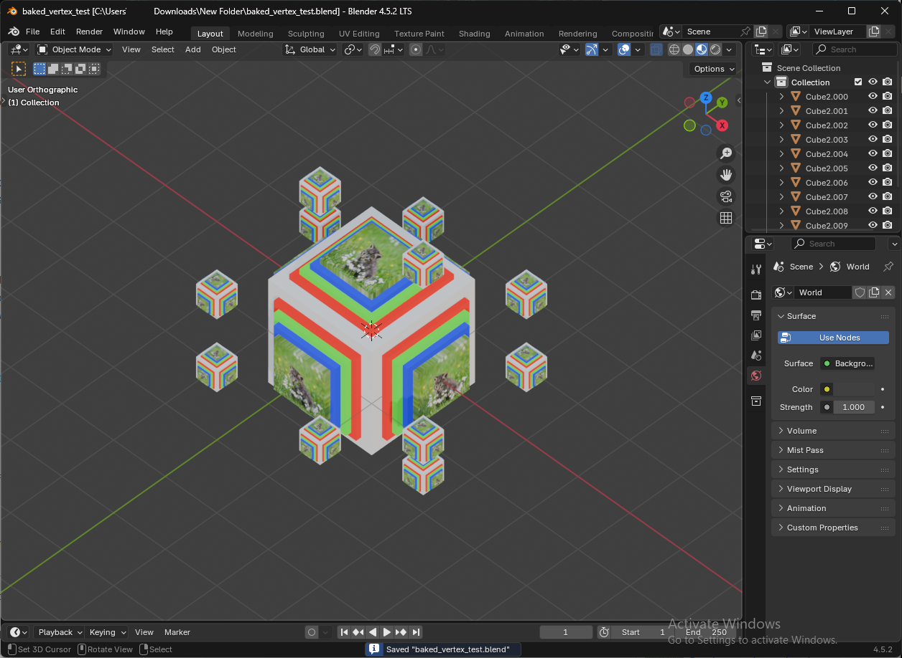
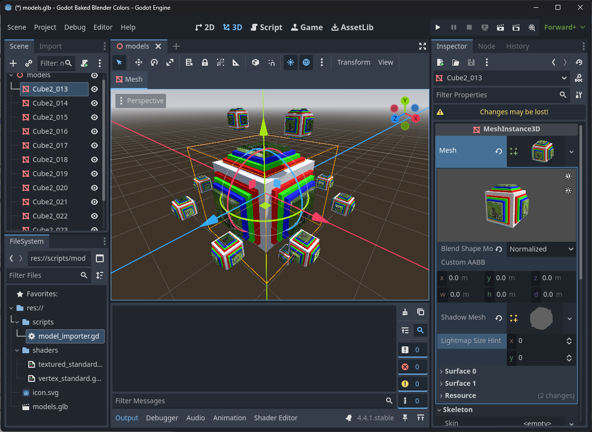

# Godot Blender Vertex Baker

This project provides a way to import material-less colored meshes from Blender into Godot as merged meshes. This can significantly reduce draw calls for purely color-based geometry.

Features:

* A Blender add-on to export meshes with baked vertex attributes (color, emission, metallic, roughness) into .glb.
* A Godot importer to load the model and assign shader materials.

## Blender exporter

* Adds an export option: **File -> Export -> gLTF (Baked Vertex Color)**.
* Bakes material properties into mesh attributes:
  * **Albedo + Emission** - stored in `AlbedoEmission` vertex color attribute.
  * **Metallic + Roughness** - stored in UV2.
  * **Emission Strength** - stored in UV1.
* Splits objects by material, processes each surface, and rejoins them for export.
* Ignores textured materials.
* Exports `.glb` files for Godot.

### Godot importer

* Runs automatically on assigned models during import.
* Handles metadata exported from Blender:
  * `no_import` - skips importing the object.
  * `no_shadow` - disables shadow casting.
  * `instanced_material` - forces unique material instead of reusing shared ones.
* Converts imported StandardMaterials into **ShaderMaterials**:
  * Uses `vertex_standard.gdshader` or `textured_standard.gdshader`.
  * Detects if textures are present (albedo, emission, normal).
* Reuses materials where possible to save memory.

### Shaders

* **`textured_standard.gdshader`**
  Uses textures + vertex color tinting.
* **`vertex_standard.gdshader`**
  Uses only vertex colors and baked data for lightweight rendering.
Both support:
* Dithered alpha clipping (via Bayer matrix).
* Emission, metallic, and roughness baked directly into mesh data.

## Usage

1. Copy `blender_addons/gltf_baked_export.py` to your Blender add-ons folder.
2. In Blender, open **Edit -> Preferences -> Add-ons -> Install** and select the script.
3. Enable **gLTF (Baked Vertex Color) Exporter**.
4. Assign **Principled BSDF** materials in Blender (base color, emission, metallic, roughness, alpha).
5. Export models via **File -> Export -> gLTF (Baked Vertex Color)**.
6. **OPTIONAL**: You may want to save the model before export and then revert it. The exporter internally creates temporary copies of your objects to bake data. These copies are deleted after export, so the original scene remains unchanged. However, reverting after ensures no extra data sticks around.
7. Copy shaders and the `model_importer.gd` from `godot_src/` into your Godot project.
8. Assign the `model_importer.gd` to the `Import Script` path of the exported `.glb` files and click `Reimport`.

## Feedback & Bug Reports

If there are additional variations you would find useful, or if you find any bugs or have other feedback, please [open an issue](https://github.com/Donitzo/godot-blender-vertex-baker/issues).